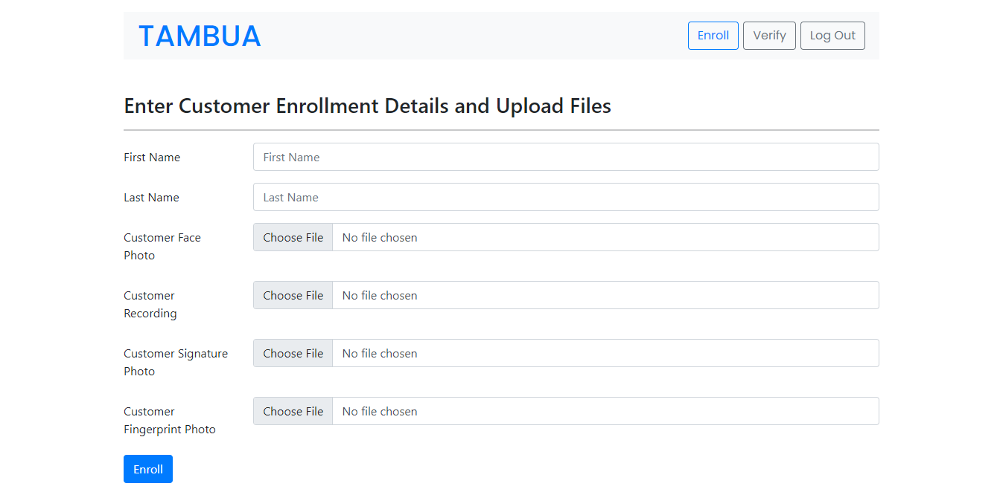

# Tambua - Digital Identity System

[](https://github.com/tterb/atomic-design-ui/blob/master/LICENSEs)

## Run The Project Locally

Clone the project

```bash
  git clone https://github.com/Murigi-Nganga/digital-identity-phoenix.git
```

Install dependencies

```bash
  pip requirements -r requirements.txt
```

Go to the project directory

```bash
  cd tambua
```

Start the Django server

```bash
  python manage.py runserver
```

## Project Screenshots





## 🛠 Skills Required

- Python (Django)
- Azure Cloud Services :
  - Azure Databases
  - Azure Blob Storage
  - Azure Cognitive Services

## Authors

- [@cherutoSharleen](https://github.com/cherutoSharleen)
- [@leslie-asava](https://github.com/leslie-asava)
- [@root458](https://github.com/root458)
- [@Murigi-Nganga](https://github.com/Murigi-Nganga)
